# BSDSentinel Automatic Server Installation and Configuration

BSDSentinel is a modular automation and management framework designed for FreeBSD-based game server environments. It streamlines server setup, configuration, build, and deployment processes through structured, step-based scripts, ensuring consistency, speed, and reliability across the entire system lifecycle.

BSDSentinel is completely open source.
All information and actions performed are recorded in the `/_freebsd_deploy_temp_` file.
## Package and Upload Server Files

Run the `server_packager.bat` script to generate the deployment archive.

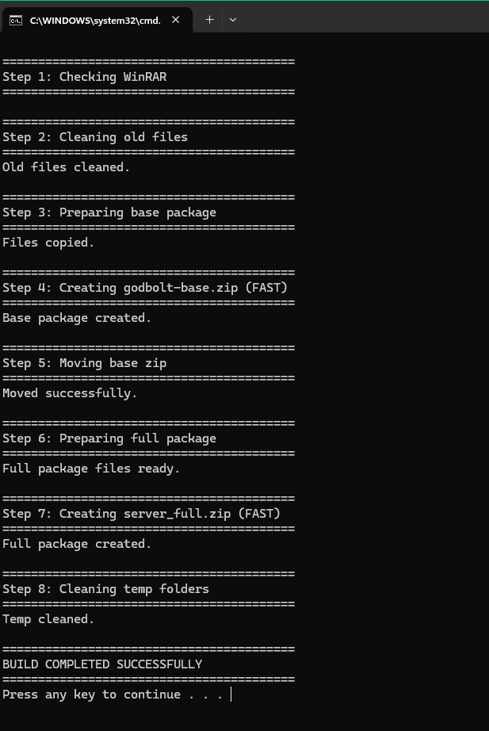

This will create a file named `server_full.zip`

```Upload the file to the FreeBSD root directory: / ```

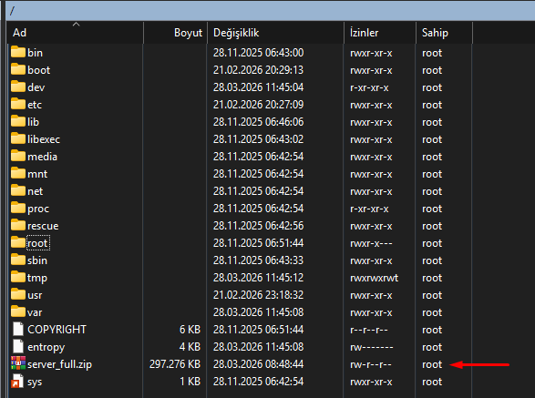


## FreeBSD instructions

Run: 
```bash
clear && cd / && unzip server_full.zip && cd /home && chmod -R 755 /home && cd /home/BSDSentinel && ./first_bsd
```

## Step 1 : Protecting the connection
It is recommended to follow the instructions provided in Step 1 to prevent connection interruptions during the installation process.

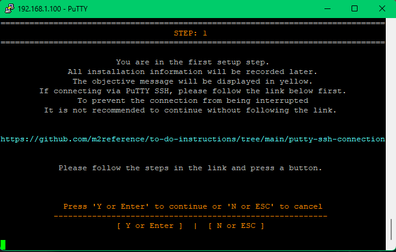

```bash
https://github.com/m2reference/to-do-instructions/tree/main/putty-ssh-connection
```

`Click : Enter`

## Step 2 : System Verification and IP Confirmation
Verify the system specifications and confirm the server’s IP address before proceeding with the installation.

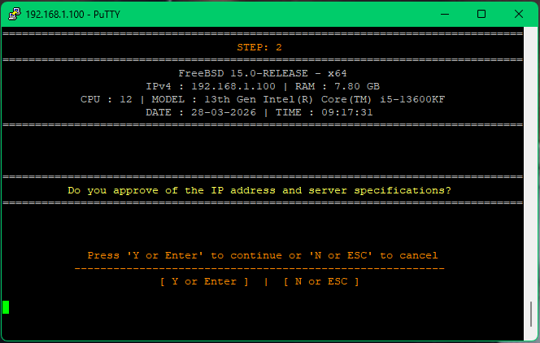

`Click : Enter`

## Step 3 : Game Name Configuration
Enter the desired game name. This value will be used as the primary identifier for folders, services, and configuration throughout the system.

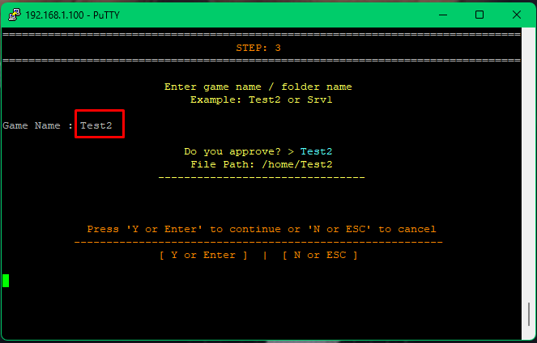

`Click : Enter`

## Step 4 : Root Password Configuration (Optional)
You may change the root password during this step if desired.

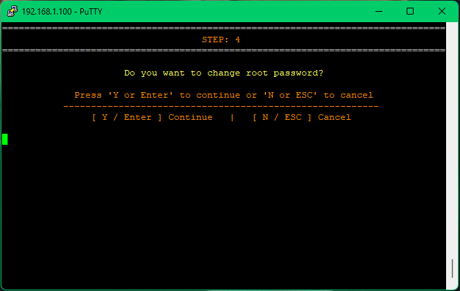

`Click : ESC`

## Step 5 : SSH Port Configuration (Optional)
You may change the SSH port during this step if desired.

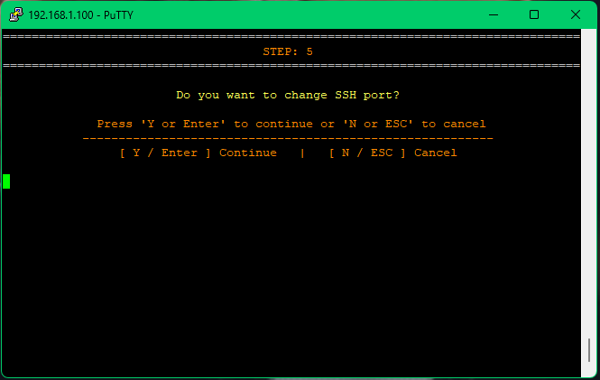

`Click : ESC`

## Step 6 : MariaDB Installation and Configuration
This step installs and configures MariaDB.
The system automatically detects and installs the latest available version.
`Note: This process may take a few minutes to complete.`

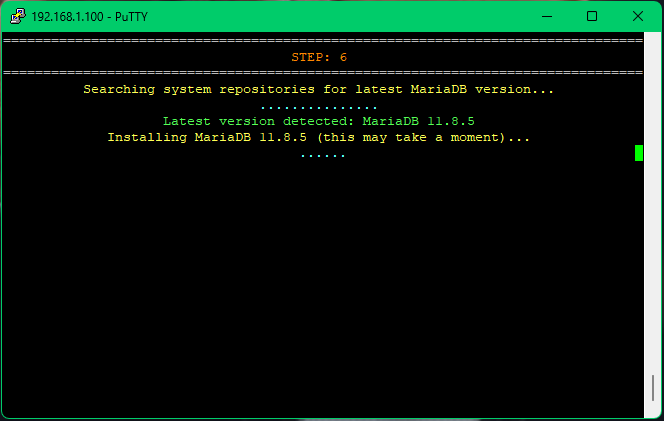

- MariaDB Root Password Configuration. You can choose to set the MariaDB root password either manually or generate it randomly during this step.


- Remote Access User (Optional). Do you want to create a remote access user? if you want to enable remote access (e.g., for tools like Navicat). All connection details will be automatically saved in the following file: `/_freebsd_deploy_temp_` `Click : ENTER or ESC`
  `Click : R`

- MariaDB Port Configuration (Optional). You may change the MariaDB port during this step if desired.   `Click : R`

## Step 7 : Base File Extraction
This step runs automatically with no user prompt.

The system extracts and configures all required base files, preparing the environment for the next stages of deployment.

## Step 8 : MariaDB Proto(s) Language Selection
Select up to 16 languages for the MariaDB proto configuration.

This selection affects the `item_name` and `mob_name` data used in the database.

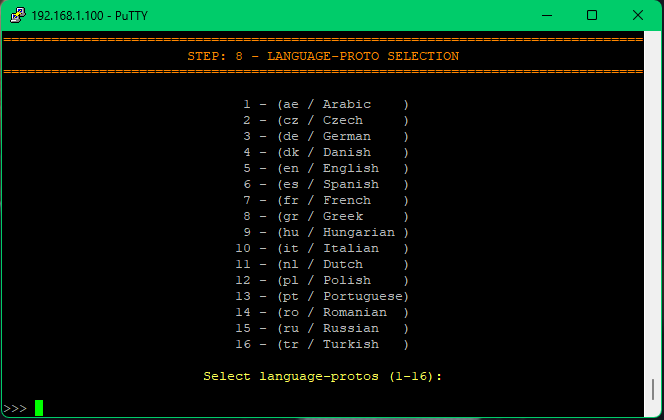

## Automated Build and Deployment

From this point onward, the system will automatically configure the server files and database, compile the source, and start the game server.

`Note: This process may take a few minutes to complete.`

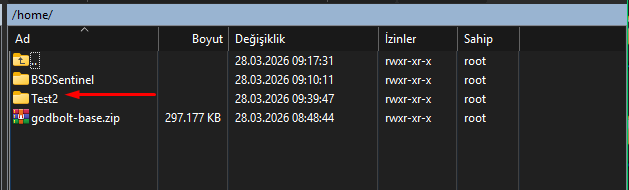
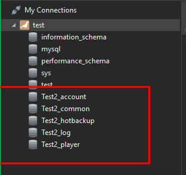
