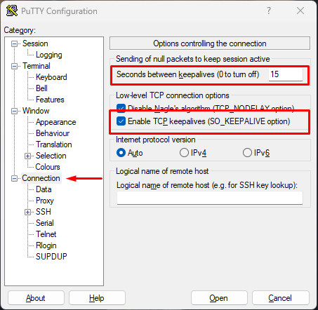
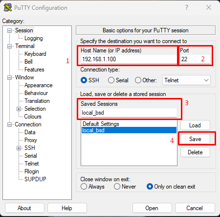

# PuTTY SSH Auto Connection & (Keepalive Fix)

This guide is designed to prevent SSH connections from dropping while idle and to enable automatic login using PuTTY.
Note: This is recommended for developers only; it is not recommended for professional production. In a professional environment, the SSH port is always closed and access is via KEY.

# 1. Problem

In some VPS or firewall systems, SSH connections may:
Disconnect after 15-20 seconds of inactivity

Reasons:
- Idle TCP timeout
- NAT timeout
- Firewall/PF closes the connection

# 2. PuTTY Keepalive & Auto Setting

PuTTY is opened. Go to the Connection tab.
- Seconds between keepalives (0 to turn off)    : 15
- Enable TCP keepalives (SO_KEEPALIVE option)   : Mark

Turn off the screen and go to the 'Session' section.
- Host Name (or IP address) : add ipv4
- Port : add ssh port
- Saved Session : add enter a custom name (example: load_bsd)
- Click 'Save'

- Click 'Cancel'

Create a shortcut for Putty.exe
- Right-click and select Properties.
- Target : "C:\Program Files\PuTTY\putty.exe" -load local_bsd -l ssh_id -pw ssh_password
- ssh_id : SSH User Name (example: root) change.
- ssh_password : SSH password (example: 1) change.
- Example Target : "C:\Program Files\PuTTY\putty.exe" -load local_bsd -l root -pw 1